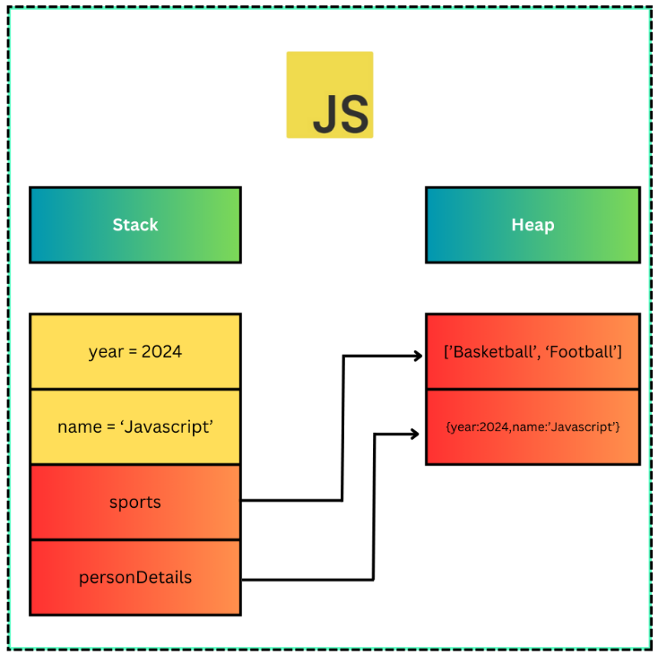

# JavaScript Nedir ?
En basit cümle ile JavaScript kısaca JS , “Geliştiricilerin etkileşimli web uygulamaları oluşturmak için kullandığı bir programlama dilidir.”

Javascript’den önce web sayfaları statikti yani okuduğumuz kitaplarda ki gibi sabit değişmeyen sayfalara sahiptiler. Statik bir sayfada içerikler sabit bir düzende görülür. Günümüzde web sayfaları dinamik olarak tasarlanıyor yani kullanıcının etkileşimine yanıt verebilir şekilde. İşte Javascript web uygulamalarını daha dinamik hale getirmek için tarayıcı bazlı bir teknoloji olarak ortaya çıktı. JavaScript’de ki gelişmeler arttıkça JavaScript hem istemci hem sunucu tarafında kullanılmaya başlandı. Bu da günümüzde ki en çok kullanılan programlama dillerinden biri olmasını sağladı .

Bu kısımda daha fazla teorik bilgi verip yazıyı uzatmak istemedim bu yüzden JavaScript’in tarihçesi, kullanım alanları vb… konularda araştırma yaparsanız çok iyi olur.

# Değişken Nedir ?
Herhangi bir programlama diline başlamadan önce bazı temel kavramları öğrenmek en doğrusu.

Değişkenler, programlama dillerinde bilgileri geçici olarak depolamak için kullanılır ve bu bilgiler daha sonra program içinde kullanılmak üzere çağrılabilir.

Örneğin, Js dilinde bir kişinin adını ve soyadını depolamak için bir değişken kullanalım:
`   let adSoyad = 'Mustafa Gözcü'  ` 
Burada ki let ifadesi Js’de değişken oluştururken kullanmamız gereken bir anahtar kelime toplamda 3 tanedir, bunlar var, let, const ve bunları kullanım durumlarına göre kullanıyoruz işte değişkenin tam olarak ne olduğunu bilmeden bu anahtar kelimelerini öğrenmeye çalışsaydık bizim için zor olurdu. Örnekde ki adSoyad ifadesi ise değişkenimize verdiğimiz isim oluyor, buraya daha farklı şeylerde yazabilirsiniz ama bunun belli bir standartı var. = işaretinden sonraki kısımsa değişkenimizin değerini ifade ediyor. Yani değişkenimizin adı adSoyad , değeri ‘Mustafa Gözcü’ şeklinde ki String bir ifade. ( String’de js’de bir veri tipidir detaylı olarak ilerleyen bölümlerde işleyeceğiz şimdilik sadece bunu bilsek yeter)

### JavaScript’de değişken tanımlama anahtar kelimeleri
Değişkenin ne olduğunu öğrendikten sonra bu değişkenleri oluştururken kullanmak zorunda olduğumuz anahtar kelimeleri öğrenelim. Toplamda 3 tane var demiştik bunlar var, let, const . Günümüzde var çok tercih edilmiyor. Peki neden birbirinden farklı anahtar kelimeleri var diye düşünecek olursak , scope ( kapsam ) durumundan dolayı diyebiliriz. Bu scope (kapsam) kavramını ilerleyen bölümlerde daha detaylı şekilde inceleyeceğiz şimdilik bunu bilmemiz yeterli ;

JavaScript’te “scope” (kapsam), bir değişkenin erişilebilir olduğu belirli bir bölgeyi ifade eder. Kapsam, değişkenlerin tanımlandığı ve kullanılabildiği alanı belirler.

Kısaca farklı zamanlarda değişebileceğini düşündüğümüz değerler için let, eğer hiç bir şekilde değişmeyen değerler olacaksa const (pi sayısı vb…) anahtar kelimesini kullanıyoruz. Dediğim gibi ilerleyen bölümlerde daha detaylı bir şekilde değineceğiz.

```
const pi = 3.14; 
 var x = 5; 
let y = "Merhaba";

```
En önemli temel kavramları öğrenmiş olduk şimdi biraz daha derinleşelim. Her programlama dilinde olduğu gibi Js’de de veri tipleri mevcut. Fakat veri tiplerinden önce Js’in bilgisayar belleğini nasıl kullandığını anlatmanın, veri tiplerini anlamada daha kolaylık sağlayacağını düşünüyorum. Bu yüzden;

# Javascript'de Bellek
Javascript, taryıcı tarafında çalışan bir dildir yani tarayıcı belleği üzerinde çalışır. Bir web sayfası açıldığında taryıcı Javascript kodunu yorumlar ve çalıştırır. Örnek olarak Html dosyaları içinde <script> etiketi kullanarak javascript kodu tarayıcıda çalıştırılabilir.

Node.Js ile birlikte Javascript tarayıcı dışında da çalışabilir. Yani sunucu tarafında. Böylece tarayıcı belleğinde değil, bilgisayarın genel bellek alanında çalışmış olur. Node.js Google Chrom’un V8 motorunu kullanarak, Javascript kodlarını sunucu tarafında çalıştırmak için tasarlanmış bir platformdur. Şimdilik Node.js tarafında bunları bilmemiz yeterli.

Yukarıda ki bilgileride göz önünde bulundurarak Javascript , değişkenlere atadığımız değerleri bellekte saklamak zorundadır yani Javascript bellek yönetimi için genellikle iki temel bellek alanını kullanır. Stack ve Heap

Burada stack ve heap’in ne olduğundan bahsetmeyeceğim ama genel manada şunları söyleyebilirim. Bu bellek alanları bilgisayarın ram’inde bulunur. Bu alanlar işletim sistemi ve dilin çalışma zamanı tarafından yönetilir. Bu nedenle programcılar veya yazılımcılar her ne derseniz :) :) genellikle bellek yönetimiyle doğrudan ilgilenmezler ve dilin veya çalışma zamanının otomatik bellek yönetimi özelleiklerinden yararlanırlar.

# Javascript Veri Tipleri
Bellek kullanımı hakkında temel bilgileri öğrendikten sonra Javascript’de veri tipleri kısmına geçebilirz. Javascript’de veri tipleri değişkenlerin içinde saklanan verinin türüne göre sınıflandırılmasını ifade eder. Bu şekilde bilgisayar verinin saklanacağı belleğin alanını buna göre ayırmasına ve uygun işlemleri gerçekleştirmesine yardımcı olur.

Javascript’de iki farklı veri tipi vardır.

1- Primitive (İlkel) Veri Tipleri
2- Non-Primitive (İlkel Olmayan) Veri Tipleri

Bu resmi aşağıdaki açıklamalardan sonra tekrardan inceleyin daha iyi anladığınızı fark ediceksiniz :)

# Primitive (İlkel) Veri Tipleri
Javascript’de ilkel veri tipleri, basit ve doğrudan değerleri temsil eden veri tipleridir. Bir değişken primitive (ilkel) veri tipi olarak tanımlanırsa belleğin stack bölümünde depolanır yani stack bölümünde bir alan tutarlar ve bu alan içerisindeki değer değiştirilemez. Buna immutable yani değiştirilemez veri türleri denilir.
```   
let word = 'JavaScript Öğreniyorum'
word[0]='A';

console.log(word)
```
Yukarıdaki örnekte yaptığımız gibi bir string değişken tanımlayalım ( string değişkenler karakter dizileridir) word[0] diyerek bu dizinin ilk elemanına ulaşıp bunu A olarak belirleyelim ardından console.log(word) diyip bu değişkeni yazdırdığımızda herhangi bir değişikliğin olmadığını yani ‘JavaScript Öğreniyorum’ yazısının ekrana yazdırılacağını göreceksiniz.

Peki bu primitive (ilkel) veri tipleri nelerdir ?

String,Number,Boolean,Null,Undefined.Bunlar hakkında kısa bilgiler verip tanımlamasını yapacağız , bu serinin diğer yazılarında daha detaya ineceğiz.

1.String (Metin): Metin verilerini temsil eder ve bir dizi karekterden oluşur.

``` let word = "Hello World"     ```

2. Number (Sayı) : Sayısal verileri temsil eder. Tamsayılar veya ondalık sayılar olabilir.
```   
let number1 = 34;
const pi = 3.14;
   
```
3.Boolean : Mantıksal değerleri temsil eder. ‘true’ veya ‘false’ değerlerini alır.

```   
let isCorrect = true;

let isFalse = false;

```
Bu kısımın anlaşılması ilk başta zor olabilir ve mantıksız gelebilir fakat Javascript bilginiz arttıkça daha iyi oturacaktır.

4.Null : Tanımlanan bir değişkene null değeri atandığında bellekte bir alan ayrılır fakat bu alanın içerisinde bir değer olmadığını söylemiş oluyoruz. Javascript’de null veri tipi primitive veri tipi olmasına rağmen , non-primitive olarak algılanır. Bunun için daha sonra bir örnek verilecek.
```    
let value = null;

```
5.Undefined : Tanımlanan bir değişkene değer atanmamışsa yani bir değişkenin değeri yoksa bu undefined olarak ifade edilir.
```     
let value;
```
Kısacası null , bir değişkenin değerinin bilerek boş bırakıldığını ifade eder , undefined ise değerin atanmamış olduğunu ifade eder.

# Non-Primitive (İlkel Olmayan) Veri Tipleri
Bu veri tiplerine Non-primitive , Referans , Object’ de deniliyor. Türkçe olarak nesne türü diyebiliriz. Bu veri tipleri daha karmaşık verileri tanımlayıp, depolamak için kullanılır ve referanslarına göre karşılaştırılırlar. Referans kavramını ilk başta idrak etmek zor olabilir fakat aşağıdaki örnekleri inceledikçe daha iyi anlayacağız.

Bu veri tiplerinde tanımlanan değişkenlerin bellekte tuttuğu alan içerisindeki değerler değiştirilebilir yani mutable (içeriği değiştirilebilir).

Bu veri tipleri : Object , Array , Function , Date …

Şimdi bir dizi tanımlayalım :
```     
let array = [1,2,3]

 ```
 Şimdide bir obje tanımlayalım:

``` 
let obj1 = { name:"Mustafa"}

let obj2 = obj1

console.log(obj2.name)

obj1.name = "Mehmet";
console.log(obj2.name)   

  ```
Bunların tanımlanmasına veya yazılış biçimlerine çok takılmayalım serinin ilerleyen yazılarında detaylı bir şekilde öğreneceğiz. İlk başta bir dizi tanımladık [ ] köşeli parantezlerin içine sayıları yazdık. Daha sonra bir obje tanımladık bunun içinde küme parantezini kullandık { } yani bir obje oluşturduk ve içine name adında bir property (özellik) tanımladık bu özelliğin değeride string bir ifadedir.

let obj2 = obj1; diyerek obj1'in ve obj2'nin referanslarını eşitledik. Bakın referans kavramını kullandım neden çünkü primitive veya object veya referans veri tiplerinde değerler referansa göre atanır.

Yani obj1'in referans ettiği nesneyi aynı zamanda obj2'nin referans ettiği nesne yaptık. ( let obj2 = obj1 bu kodu kullanarak)

Daha sonra console.log(obj2.name) diyerek obj2'nin referans ettiği nesnedeki özelliği yazdırmak istedik ve sonuç Mustafa olacaktır. Çünkü yukarıda iki objeninde referansını eşitledik.

obj1.name = “Mehmet” dediğimizde name özelliğini değiştirmiş olduk. Ardından console.log(obj2.name) yazdırdığımızda ekranda Mehmet yazısını göreceğiz halbuki daha önce console.log(obj2.name) dediğimizde Mustafa yazısını görmüştük bunun sebebi obj1.name’i Mehmet olarak değiştirmemiz ve obj2'nin obj1'in referans ettiği değere eşit olmasıdır.